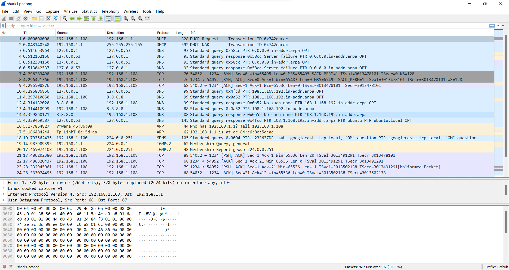
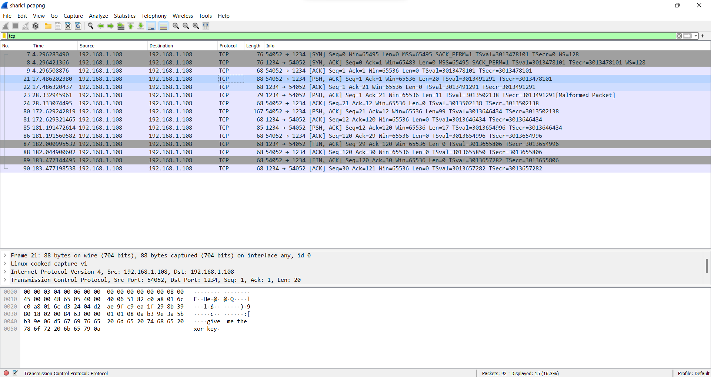
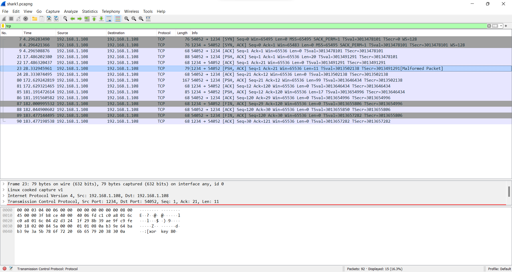
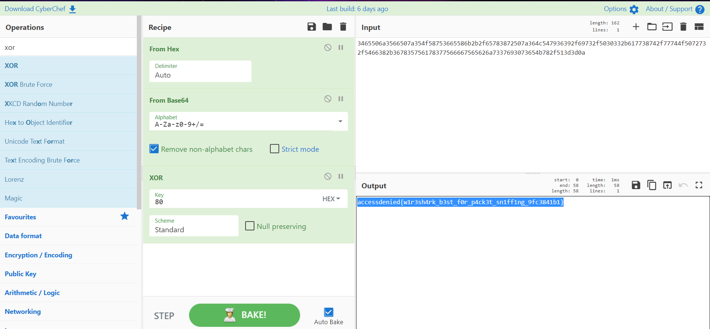

### Chall Desc:
Nobody likes traffic, but what about network traffic?

### File attached: 
[shark1.pcapng](shark1.pcapng)

### Soln:

We look into the file first.


On looking at the tcp stream, we can see something given. There we get a xor key.





The data which we get as the flag in tcpdump is :
```py
486572652069732074686520666c61673a203465506a3566507a354f58753665586b2b2f65783872507a364c547936392f69732f5030332b617738742f77744f5072732f5466382b367835756178377566667565626a7337693073654b782f513d3d0a
```

Now, we can use cyberchef to get our flag in three steps.

First we will convert hex to ascii.
Then we convert the flag from base64.
Then we will xor it with the key we got i.e `80`.



#### THE FLAG: accessdenied{w1r3sh4rk_b3st_f0r_p4ck3t_sn1ff1ng_9fc3841b1}

Thank you
