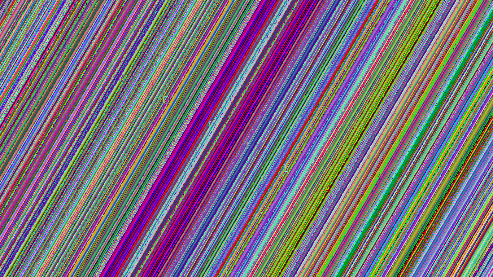

Hi guys, this was a very basic question asked on steganography in HeroCTF.

Have a look.

# List of tools i tried using on this png.
pngcheck, strings, exiftool, binwalk, hexedit. None of them gave any information. 
Then i went to online steg solving sites and using LSB half i could see the flag written diagonally.

Sites used:

https://medium.com/ctf-writeups/stegonline-a-new-steganography-tool-b4eddb8f8f57
https://aperisolve.fr/5fddad24e8093e8f9bff3d933091ea57
