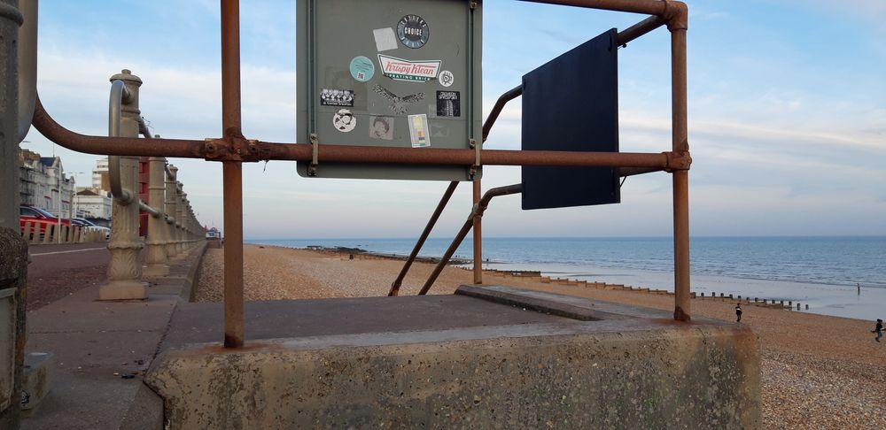
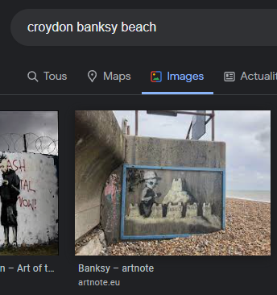

### Chall Desc:
For this challenge, Alol has placed a nice sticker on a panel above a work of art somewhere in the world, and we have to find the name of it.

Here is the image given:

#### Soln:

First thing, we are outdoors. The work is therefore street art. Who says street-art often says: Banksy .

In addition, we are on a pebble beach with gray barriers very typical of English beaches. Street art in England? Banksy .

Now it remains to find where we are exactly. Zooming in on the other stickers, we notice two bearing the same inscription.

"Croydon Spaceport". Hmmm...Croydon...Isn't that a city in England?

Searching for "Croydon banksy beach", we come across an image on Google.

Bansky artnote.

Our favorite fence! And this painting, named "Tesco Sandcastle".

#### THE FLAG: Hero{Tesco Sandcastle}

Thank you
