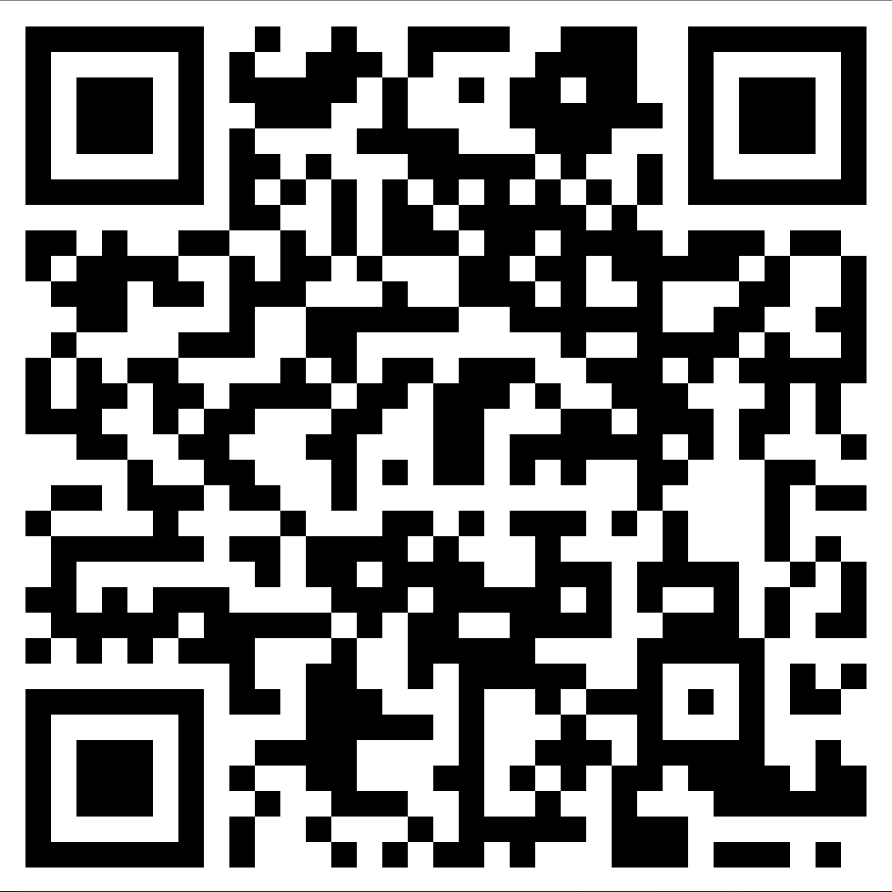

### Chall Desc: 
John and Sebastian are always arguing over one thing or another. This time round, John is of the opinion that a certain type of visual representation of files looks cooler while Sebastian argues that his favourite, QR Codes, look cooler. Unable to resolve this quarrel on their own, they went to their good friend Amaagah, who knew a fair bit about these topics. Amaagah, after giving it some thought, gave both of them a file which confused the two of them. Will you help John and Sebastian to settle their debate once and for all?

### File attached: [qrcode.png](qr.png)

## Soln: 

We are given a qr.png image. 

On scanning the qr we get a link:  
https://mega.nz/file/PxNFAThY#meUPeNKxwC1o7K72Plb4oEaMEvT-m3gBVmyCzHlBBOo  

There is an audio file in the link.

The given file can be viewed under SONIC VISUALIZER which is used for viewing spectograms and waveforms of audio file.    

We right click and add a spectogram to our audio file.   

The flag is somewhat visible after that and readable enough to construct the flag.  

## THE FLAG: n00bz{sp3ct09r4m5_4r3_c00l3r_th4n_b4rc0d35}

Thank you
