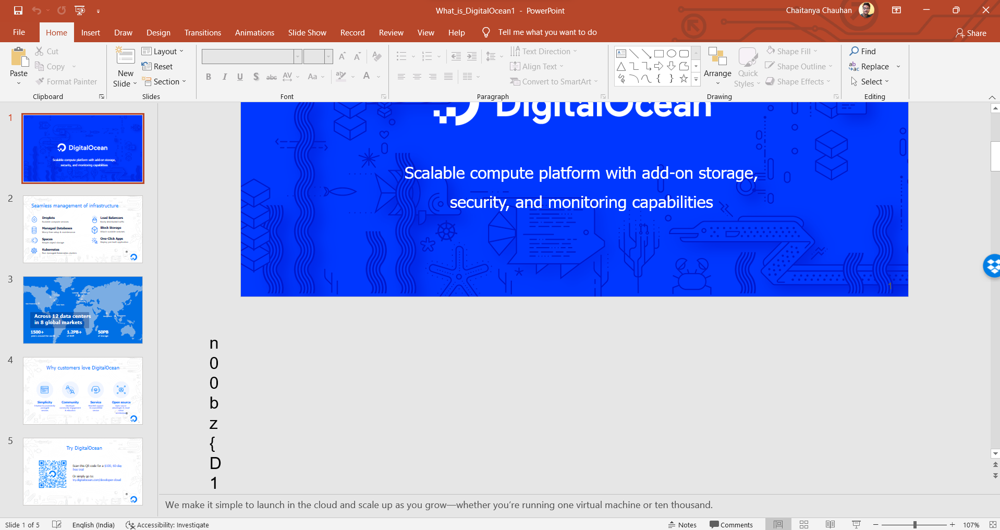

### Chal Desc: 
DigitalOcean is one of our biggest sponsors!

### File attached: [DigitalOcean.pptx](w.pptx)

### Soln: 
This is a simple challenge. if we scroll down in the powerpoint presentation we can view chunks of flag hidden in the file itself.
Framing them together into one line makes the flag.

<h>
  
 </h>

#### THE FLAG: n00bz{d1g1t4l_0c34n1s_5p0n50r1ng_u5_2000_d0ll4r5_w0r7h_0f_cr3d1t5_7h4nk_y0u_s0_much}

Thank you
