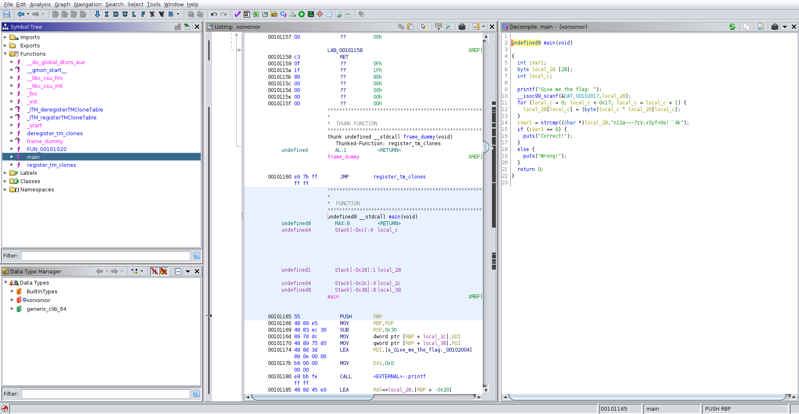

### Chall Desc:
xor ftw

### File attached:
[xorxorxor](xorxorxor)

#### Soln: (Author FusterCluck)

We are given a binary file which checks if the flag is correct or not. We open the binary in Ghidra and analyze the functions.  
We see the flag check occurs in main (img1). Renaming the variables for them to make sense, we see that the flag is 28 characters long and an encrypted flag is given   (n12a~~~7zV;xSyf<Os!``4k).  
Each character of the flag is XORred with its index to get the encrypted flag. Solve.py has the reversing solution.
``




Python script for flag:

```python
from pwn import xor

enc = "n12a~~~7zV;xSyf<Os!``4k"
flag = b''

for i in range(len(enc)):
    flag += xor(ord(enc[i]), i)

print(flag)
```

Thank you
