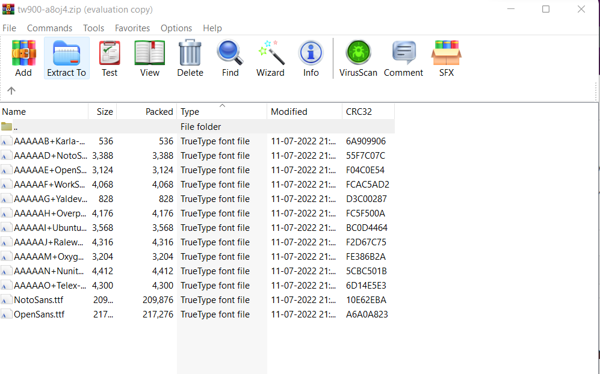

### Chall Desc:
Someone sent me this PDF claiming that he has found the flag, but things don’t really seem that obvious. Also, did you notice that something is a bit off with the text?

Flag format (RegEx): vsctf\{[a-z]+\}

### File attached : [whatistheflag.pdf](whatistheflag.pdf)

### Soln: 

On opening the pdf, we can see a sample flag given inside it `vsctf{whatistheflag}` !

Ofcourse, it is not the right flag but one noticeable thing is we cannot select the whole string at once and some strings are highlighted inside the pdf.

After searching on google, we get a website where we can extract the fonts used in a pdf.
https://www.pdfconvertonline.com/extract-pdf-fonts-online.html

Using it, we get a zip file containg the fonts.

It doesn't make much sense looking at the list of fonts until first letter of each font starts making words.

It becomes somehwat `KNOWYOURONT` which looks something like know your fonts, 

using https://www.extractpdf.com/, we get two more fonts which is a `f` and a `s` which makes the whole flag.

#### THE FLAG : vsctf{knowyourfonts}

Thank you
